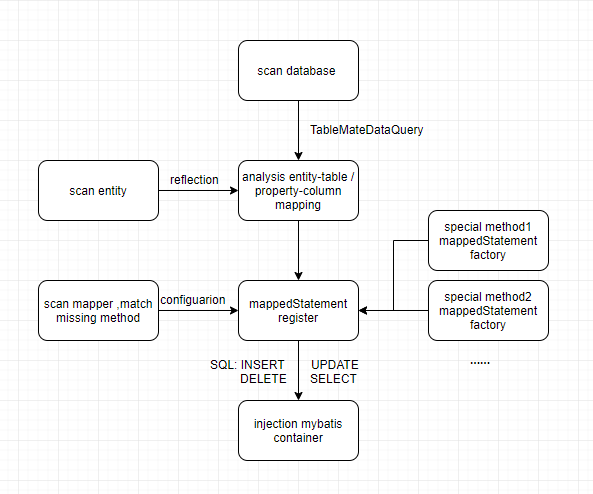

### 简介：
基于MyBatis二次开发，在MyBatis的基础上只做增强不做改变，提高开发效率。

### 特征：
-   1.无侵入：启动阶段为符合特定规则的mapper方法自动注入，启动成功之后完全委托Mybatis管理，与Mybatis有很好的兼容性。
-   2.消耗小：启动成功之后完全委托Mybatis管理，框架本身不再执行任何其他任务。
-   3.灵活性：允许开发人员使用Mybatis原有机制（xml/注解）覆盖默认实现（默认方法不可以覆盖），允许切换table schema解析策略。
-   4.扩展性：预留大量扩展点，允许开发人员根据需要配置或扩展。
    -   4.1. 允许根据需要实现MappedStatement工厂扩展自动注册的方法 
    -   4.2. 支持基于注解的细粒度配置，提供全局匹配实现默认配置，并支持自由实现自定义解析器扩展配置
-   5.功能：除自动注入特定方法外，支持逻辑列、复合主键、默认where条件、默认赋值、禁止特定列查询/修改/新增、动态条件查询、方法名称解析注册。

## 目录结构

```bash
|-- mdsr-base                          ➜ 基础模块
|-- mdsr-mysql-adapter                 ➜ mysql适配模块
|-- mdsr-code                          ➜ 核心模块
|-- spring-boot-starter-mdsr           ➜ 基于mybatis-spring-boot-starter组装可运行的[mdsr-core]
|-- spring-boot-starter-mdsr-sample    ➜ 演示服务
```
  
### 实现流程:
<p align="center">
  <a>
   
  </a>
</p>  

### 构建项目:
JDK 8+, Maven 3+ 

### 支持的数据库:
*支持的数据库*:
部分mapper方法支持标准sql实现,适用所有数据库(参考*com.github.ibatis.statement.mapper.method.MapperMethodEnum*#common=true),
其他需要使用数据库自定义语法的接口目前仅实现了mysql 、mariaDB 、H2(MODE=MySql)的适配
> 其他数据库需实现适配器,参考mysql适配模块,通过SPI机制获取服务提供者
```xml
    <dependency>
        <groupId>com.github.X1993</groupId>
        <artifactId>mdsr-mysql-adapter</artifactId>
        <version>1.0.0-SNAPSHOT</version>
    </dependency>
```    

### [快速开始](./spring-boot-starter-mdsr-sample)
