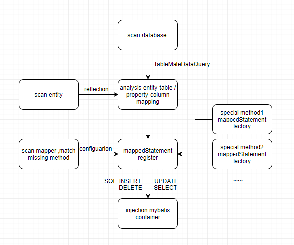

### 运行环境:
JDK 8+, Maven, Mysql/MariaDB/H2/(OTHER有特殊要求)

### 支持的数据库:  
1.TableSchemaResolutionStrategy=DATA_BASE，适用mysql 、mariaDB 、H2
> 其他数据库只需实现特定的适配器
```java
    /**
    * @see com.github.ibatis.statement.register.database.TableSchemaQuery
    */
```
2.TableSchemaResolutionStrategy=ENTITY，适用Mybatis支持的所有数据库

### 流程框架:
<p align="center">
  <a>
   
  </a>
</p>

### [文档](DOCUMENT.md)

### [快速开始](../spring-boot-starter-mdsr-sample)

  
